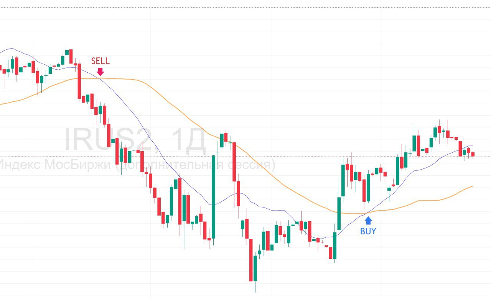

# Торговый робот "Hello World"

Простая и понятная стратегия для начала изучения алготрейдинга. Скачай и запусти

Идея стратегии основана на пересечении скользящих средних (SMA Crossover)

## Сигналы

| Сигнал | Условие | Описание |
|--------|---------|----------|
| BUY 🟢 | Быстрая SMA пересекает медленную снизу вверх | Сигнал на покупку |
| SELL 🔴 | Быстрая SMA пересекает медленную сверху вниз | Сигнал на продажу |



## Особенности

### Преимущества
- ✅ **Простота**: всего 2 индикатора, понятная логика
- ✅ **Надежность**: классика, работает на трендовых рынках
- ✅ **Бейзлайн**: идеально для сравнения с более сложными стратегиями

### Недостатки
- ⚠️ **Запаздывание**: SMA отстают от цены, поздние входы
- ⚠️ **Ложные сигналы**: плохо работает во флете

## 📁 Структура торгового робота
```
bot/
│
├── config/                    # ⚙️ Конфигурация
│   ├── venue_config.py        # Параметры подключений к API
│   ├── trading_config.py      # Технические настройки робота
│   └── algo_params.py         # Параметры стратегии
│
├── data/                      # 📊 Получение данных
│   └── moex_client.py         # Работа с API MOEX
│
├── indicators/                # 📈 Расчет технических индикаторов
│   └── technical.py           # SMA
│
├── strategies/                # 🎯 Торговые стратегии
│   ├── base_strategy.py       # Базовый класс стратегии
│   └── sma_crossover.py       # Hello World стратегия
│
├── execution/                 # 💼 Исполнение ордеров
│   └── order_manager.py       # Управление ордерами
│
├── core/                      # 🔧 Ядро системы
│   ├── trading_engine.py      # Основной торговый движок
│   └── portfolio.py           # Управление позицией
│
├── utils/                     # 🛠️ Утилиты
│   ├── time_utils.py          # Работа со временем
│   └── logger.py              # Логирование
│
├── main.py                    # 🚀 Точка входа (лайв-торговля)
└── requirements.txt           # 📦 Зависимости
```

## ⚙️ Параметры

**TRADING_CONFIG:** Технические настройки робота
```python
TRADING_CONFIG = {
    'ticker': 'GAZP',                 # Код инструмента
    'quantity': 700,                  # Кол-во лотов
    'trading_start_time': '07:05:00', # Время начала работы робота
    'trading_end_time': '23:40:00',   # Время окончания работы робота
    'history_days': 3,                # Подгрузка последних исторических данных при старте
    'fetch_interval': 60,             # Получение апдейта котировок каждые 60 секунд
    'timeframe': 10,                  # Работаем на 10 минутных свечах
}
```

**ALGO_PARAMS:** Гиперпараметры торгового алгоритма
```python
SMA_CROSSOVER_PARAMS = {
    'sma_fast': 5,  # Параметр быстрой скользящей средней, 5 последних свечей
    'sma_slow': 15, # Параметр медленной скользящей средней, 15 последних свечей
}
```

**VENUE_CONFIG:** Настройки подключений к API
```python
ARENAGO_CONFIG = {
    'url': 'https://arenago.ru',       # Заявки отправляем на платформу arenaGo
    'token': '054078..........ee8b51', # Токен для работы с платформой
    'bot': 'baseline_bot'              # Наименование робота (счета)
}

# Получаем данные с Биржи
MOEX_DATA_API = 'https://iss.moex.com/iss/engines/stock/markets/shares/boards/tqbr/securities'
```


## 🚀 Быстрый старт

### 1️⃣ Настройка конфигурации

Отредактируйте `config/venue_config.py`:
```python
ARENAGO_CONFIG = {
    'bot': '...'    # Создайте робота на https://arenago.ru и впишите сюда его наименование
    'token': '...', # Создайте токен и впишите сюда
}
```

### 2️⃣ Запуск лайв-торговли
```bash
python main.py
```

Результат торговли можно смотреть на arenago.ru


## 🎓 Как работает робот

1. Робот запускается
2. Скачивает исторические 10 минутные свечи по GAZP за последние 3 дня через API MOEX
3. Каждые 60 сек. получает новые свечи с актуальными ценами
4. Считает индикаторы скользящей средней
5. Проверяет есть ли сигнал на покупку или продажу
6. Если да, то отправляет заявку на покупку/продажу на arenago.ru
7. Возвращается к п.3
8. В 23:40 робот останавливается и закрывает все открытые позиции

Результаты торговли можно смотреть в live на arenago.ru
Все действия робота логируются

## ⚠️ Disclaimer

Код предоставлен в образовательных целях. Торговля на финансовых рынках связана с риском потери капитала. 

## 🤝 Контакты

telegram: [@arenago_ru](https://t.me/arenago_ru)

Создано для платформы arenago.ru 🚀

## 📦 Зависимости
```txt
requests>=2.31.0    # HTTP запросы к API
pandas>=2.0.0       # Обработка данных
numpy>=1.24.0       # Математические вычисления
tqdm>=4.65.0        # Progress bars
```


# Куда можно двигаться дальше: 50 шагов трансформации демо-бота в прибыльную торговую систему

## 🎯 Улучшение качества данных (пункты 1-8)

### 1. Мультитаймфреймовый анализ
**Проблема:** Сейчас бот смотрит только на один таймфрейм (10 минут)

**Решение:** Добавить анализ на нескольких таймфреймах одновременно
- Долгосрочный тренд (дневные свечи)
- Среднесрочный (часовые свечи)
- Краткосрочный (10-минутные)

**Реализация:** Торговать по краткосрочному сигналу только если он совпадает с трендом на старших таймфреймах

### 2. Фильтрация качества данных
**Проблема:** API может давать некорректные данные (гэпы, выбросы)

**Решение:** Добавить модуль валидации данных
- Проверка на аномальные прыжки цены (>5% за минуту)
- Выявление пропусков в данных
- Интерполяция или отбрасывание плохих данных


### 3. Обогащение данных объемами
**Проблема:** Сейчас используется только цена
**Решение:** Включить анализ объемов торгов
- Volume Profile
- VWAP (Volume Weighted Average Price)
- OBV (On-Balance Volume)

**Польза:** Объемы показывают силу движения, отфильтровывают ложные пробои

### 4. Добавление стакана заявок (Order Book)
**Проблема:** Нет информации о глубине рынка

**Решение:** Парсить Level 2 данные
- Размер заявок на покупку/продажу
- Дисбаланс стакана
- Крупные заявки (айсберги)

**Применение:** Входить только когда стакан поддерживает направление сделки

### 5. Микроструктура рынка
**Проблема:** Не учитывается spread и проскальзывание

**Решение:** Моделирование реальных издержек
- Bid-Ask spread в разное время дня
- Проскальзывание в зависимости от объема
- Исполнение по худшей цене


### 6. Альтернативные источники данных
**Проблема:** Зависимость от одного источника

**Решение:** Добавить резервные источники
- Finam Export
- Investing.com
- Yahoo Finance (для сравнения)

**Польза:** Кросс-валидация данных, защита от сбоев API

### 7. Исторические режимы рынка
**Проблема:** Стратегия не адаптируется к текущему режиму

**Решение:** Классификация рыночных режимов
- Тренд (бычий/медвежий)
- Флет (консолидация)
- Высокая/низкая волатильность

*Применение:** Использовать разные стратегии для разных режимов

### 8. Корпоративные события
**Проблема:** Бот торгует во время дивидендных гэпов

**Решение:** База данных корпоративных событий
- Дивиденды (дата закрытия реестра)
- Сплиты акций
- Новости и отчеты компаний

---

## 🧠 Категория 2: Продвинутые стратегии (пункты 9-18)

### 9. Машинное обучение для предсказания
**Проблема:** Простые индикаторы запаздывают

**Решение:** ML-модели для предсказания цены
- Random Forest для классификации (вверх/вниз/боком)
- LSTM для временных рядов
- XGBoost для feature importance

**Фичи:** 50+ технических индикаторов, объемы, время суток


### 10. Ансамбль стратегий
**Проблема:** Одна стратегия не работает всегда

**Решение:** Комбинация нескольких стратегий
- Взвешенное голосование (по Sharpe Ratio)
- Динамическое переключение
- Портфель стратегий

### 11. Sentiment Analysis (анализ настроений)
**Проблема:** Не учитывается новостной фон

**Решение:** NLP анализ новостей и соцсетей
- Парсинг RBC, Ведомостей, Коммерсанта
- Анализ Telegram-каналов трейдеров
- Scoring от -1 (негатив) до +1 (позитив)

**Применение:** Не входить в лонг при негативных новостях

### 12. Статистический арбитраж
**Проблема:** Одна бумага - высокий риск

**Решение:** Pairs Trading (парный трейдинг)
- SBER vs VTBR (два банка)
- LKOH vs ROSN (две нефтянки)
- Z-score коинтеграции

**Преимущество:** Рыночно-нейтральная стратегия

### 13. Mean Reversion с умными порогами
**Проблема:** Фиксированные Bollinger Bands не адаптируются

**Решение:** Динамические пороги
- Пороги зависят от волатильности (ATR)
- Разные пороги в разное время дня
- Пороги зависят от режима рынка

**Модуль:** `strategies/adaptive_mean_reversion.py`

### 14. Momentum с фильтрацией ложных пробоев
**Проблема:** Много ложных пробоев уровней
**Решение:** Подтверждение пробоя
- Объем выше среднего (1.5x)
- Закрепление выше уровня (2-3 свечи)
- RSI подтверждает силу
**Модуль:** `strategies/confirmed_breakout.py`

### 15. Market Making стратегия
**Проблема:** Стратегии только односторонние

**Решение:** Двусторонние заявки (bid + ask)
- Выставлять лимитные заявки с двух сторон
- Зарабатывать на спреде
- Требует быстрого API

**Применение:** Ликвидные бумаги во флете

### 16. Scalping с микропрофитом
**Проблема:** Слишком долгое удержание позиций

**Решение:** Ультракороткие сделки
- Таймфрейм 1-5 минут
- Тейк-профит 0.1-0.3%
- Стоп-лосс 0.05-0.1%
- 20-50 сделок в день

**Требования:** Низкие комиссии, быстрое исполнение

### 17. Overnight Gap стратегия
**Проблема:** Позиции закрываются в конце дня

**Решение:** Торговля гэпами утром
- Анализ overnight gap (разница между закрытием и открытием)
- Gap fill probability
- Вход на откате после гэпа


### 18. Адаптивные стоп-лоссы
**Проблема:** Фиксированный стоп вырезает прибыльные сделки

**Решение:** Умные стопы
- Trailing Stop (следующий стоп)
- Волатильный стоп (ATR-based)
- Временной стоп (по времени удержания)
- Стоп по прибыли (если профит >2%, подтянуть стоп к безубытку)

---

## 💼 Категория 3: Риск-менеджмент (пункты 19-28)

### 19. Kelly Criterion для sizing
**Проблема:** Фиксированный размер позиции неоптимален

**Решение:** Математически оптимальный размер
- Формула Kelly: f* = (p*b - q) / b
- где p = win rate, b = avg win / avg loss
- Ограничение: не более 25% от Kelly (для безопасности)


### 20. Pyramiding (наращивание позиции)
**Проблема:** Упускается прибыль на сильных трендах

**Решение:** Добавление к позиции
- Первый вход: 50% планируемого размера
- Добавка при прибыли 1%: еще 30%
- Добавка при прибыли 2%: еще 20%

**Правило:** Добавлять только в прибыльную позицию

### 21. Корреляционная матрица портфеля
**Проблема:** Торгуя несколько бумаг, можно переконцентрироваться

**Решение:** Анализ корреляций
- Если SBER и VTBR коррелируют 0.95, торговать только один
- Ограничение суммарного риска по коррелированным позициям


### 22. VaR (Value at Risk) расчет
**Проблема:** Неясно, сколько можно потерять

**Решение:** Оценка максимального убытка
- VaR 95% = максимальный убыток с вероятностью 95%
- Historical VaR, Parametric VaR
- Monte Carlo симуляция

*Применение:** Не открывать сделку, если VaR превышает лимит

### 23. Exposure management (управление экспозицией)
**Проблема:** Все деньги могут быть в рынке

**Решение:** Лимиты на экспозицию
- Максимум 70% капитала в рынке
- Максимум 20% на одну бумагу
- Максимум 40% на один сектор


### 24. Drawdown-based position sizing
**Проблема:** После убытков риск не снижается

**Решение:** Уменьшение размера после просадки
- При просадке 5%: уменьшить размер на 20%
- При просадке 10%: уменьшить на 50%
- При просадке 15%: остановить торговлю

**Цель:** Защита капитала в плохие периоды

### 25. Время удержания позиции
**Проблема:** Позиции могут висеть долго без движения

**Решение:** Временные лимиты
- Максимум 4 часа на одну позицию
- Если за 1 час нет движения в нужную сторону → выход

**Логика:** Деньги должны работать, а не "замораживаться"

### 26. Scaling out (частичное закрытие)
**Проблема:** Или полный профит, или полный убыток

**Решение:** Поэтапное закрытие
- При профите 0.5%: закрыть 50% позиции
- При профите 1.0%: закрыть еще 30%
- Оставшиеся 20%: держать с trailing stop

**Преимущество:** Фиксация прибыли + участие в тренде

### 27. Diversification score
**Проблема:** Неясно, насколько диверсифицирован портфель

**Решение:** Метрика диверсификации
- Effective Number of Positions = 1 / Σ(weight_i²)
- Цель: ENP > 5 (не менее 5 независимых позиций)

### 28. Circuit breakers (автоматические стопы)
**Проблема:** В экстремальных условиях бот может потерять много

**Решение:** Автоматическая остановка
- Убыток 3% за день → стоп на сегодня
- Убыток 5% за неделю → стоп на неделю
- 3 убыточных дня подряд → режим осторожной торговли (размер позиций 50%)

---

## 🔧 Категория 4: Технические улучшения (пункты 29-38)

### 29. Распределенный бэктест
**Проблема:** Бэктест одной стратегии на 1 год = 5 минут
**Решение:** Параллельные вычисления
- Multiprocessing для разных стратегий
- Ray/Dask для кластера
- GPU-ускорение (CuPy вместо NumPy)
**Результат:** Тест 100 комбинаций параметров за 10 минут

### 30. Walk-forward оптимизация
**Проблема:** Оптимизация на всей истории ведет к overfitting
**Решение:** Rolling window optimization
- Оптимизация на 6 месяцах
- Тест на следующих 3 месяцах
- Сдвиг окна и повтор
**Модуль:** `backtesting/walk_forward.py`

### 31. Monte Carlo симуляция
**Проблема:** Один бэктест не показывает возможные сценарии
**Решение:** Симуляция тысяч вариантов
- Перемешивание порядка сделок
- Добавление случайного шума к ценам
- Генерация 10,000 сценариев
**Польза:** Confidence intervals для метрик (Sharpe Ratio: 1.2 ± 0.3)

### 32. Реал-тайм мониторинг
**Проблема:** Неясно, что бот делает прямо сейчас
**Решение:** Web-дашборд
- Grafana + InfluxDB для графиков
- Текущая позиция, P&L, сигналы
- История сделок в реальном времени
**Модуль:** `monitoring/dashboard.py`

### 33. Алерты и уведомления
**Проблема:** Нужно постоянно смотреть на бота
**Решение:** Система уведомлений
- Telegram-бот для алертов
- Email при просадке >2%
- SMS при критических ошибках
**Триггеры:** Открытие/закрытие позиции, убыток, ошибки API

### 34. База данных вместо CSV
**Проблема:** CSV медленный и негибкий
**Решение:** PostgreSQL или ClickHouse
- Быстрые запросы по индексам
- Хранение миллионов свечей
- Агрегация и аналитика
**Схема:** Таблицы для candles, trades, signals, performance

### 35. API Rate Limiter
**Проблема:** API блокирует при частых запросах
**Решение:** Интеллектуальный лимитер
- Token bucket algorithm
- Очередь запросов
- Exponential backoff при ошибках
**Модуль:** `data/rate_limiter.py`

### 36. Graceful degradation
**Проблема:** При сбое API бот падает
**Решение:** Отказоустойчивость
- Кэширование последних данных
- Переключение на резервный источник
- Режим read-only при проблемах
**Принцип:** Система должна деградировать плавно, а не падать

### 37. Версионирование стратегий
**Проблема:** Неясно, какая версия стратегии в проде
**Решение:** Git-like версионирование
- Каждая стратегия имеет version hash
- Логирование версии в каждой сделке
- Откат на предыдущую версию одной командой
**Модуль:** `core/strategy_versioning.py`

### 38. A/B тестирование стратегий
**Проблема:** Неясно, какая стратегия лучше на реальном рынке
**Решение:** Параллельный запуск
- 50% капитала на стратегию A
- 50% на стратегию B
- Сравнение метрик за месяц
**Модуль:** `backtesting/ab_testing.py`

---

## 📊 Категория 5: Аналитика и оптимизация (пункты 39-48)

### 39. Trade Attribution Analysis
**Проблема:** Непонятно, что приносит прибыль
**Решение:** Декомпозиция источников прибыли
- Прибыль от тренда vs mean reversion
- Прибыль по времени суток
- Прибыль по дням недели
**Вывод:** Торговать только в прибыльные часы

### 40. Slippage tracking
**Проблема:** Реальная цена исполнения хуже ожидаемой
**Решение:** Мониторинг проскальзывания
- Разница между сигнальной ценой и исполнением
- Среднее проскальзывание по инструментам
- Worst-case slippage
**Действие:** Увеличить буфер или сменить брокера

### 41. Feature importance analysis
**Проблема:** Используется 50 индикаторов, но важны только 5
**Решение:** ML feature selection
- SHAP values для интерпретации
- Permutation importance
- Удаление бесполезных фич
**Результат:** Быстрее расчеты, меньше overfitting

### 42. Regime detection автоматический
**Проблема:** Вручную не определить смену режима
**Решение:** Hidden Markov Model (HMM)
- Автоматическая классификация на 3-4 режима
- Вероятность текущего режима
- Переключение стратегии по режиму
**Модуль:** `strategies/regime_detector.py`

### 43. Performance attribution по факторам
**Проблема:** Непонятно, почему стратегия работает
**Решение:** Факторный анализ
- Alpha = прибыль от skill
- Beta = прибыль от движения рынка
- Факторы: momentum, value, volatility
**Вывод:** Если весь профит от beta → стратегия не добавляет ценности

### 44. Overfitting detection
**Проблема:** Стратегия отлично работает на истории, плохо в реале
**Решение:** Тесты на переобучение
- Walk-forward efficiency
- Out-of-sample Sharpe Ratio vs In-sample
- Permutation test (прибыльность на рандомных данных)
**Критерий:** Если OOS Sharpe < 70% от IS Sharpe → overfitting

### 45. Transaction Cost Analysis (TCA)
**Проблема:** Комиссии съедают всю прибыль
**Решение:** Детальный учет издержек
- Комиссия брокера
- Биржевой сбор
- Проскальзывание
- Спред
**Оптимизация:** Уменьшить частоту сделок, если TCA > 30% от прибыли

### 46. Equity curve smoothness
**Проблема:** Equity curve слишком волатильна
**Решение:** Метрики гладкости
- Ulcer Index
- Pain Index
- Число локальных максимумов
**Цель:** Smooth equity curve = предсказуемая прибыль

### 47. Trade clustering analysis
**Проблема:** Сделки могут кластеризоваться во времени
**Решение:** Анализ распределения
- Сделок в час, день, неделю
- Периоды высокой/низкой активности
**Вывод:** Если 80% сделок в 2-3 часа дня → оптимизировать только это время

### 48. Benchmark comparison
**Проблема:** Непонятно, лучше ли бот просто buy-and-hold
**Решение:** Сравнение с бенчмарками
- Buy-and-hold SBER
- Индекс IMOEX
- Равновзвешенный портфель
**Критерий:** Sharpe Ratio бота должен быть > бенчмарка × 1.5

---

## 🚀 Категория 6: Продвинутые фичи (пункты 49-50)

### 49. Reinforcement Learning агент
**Проблема:** Фиксированные правила не адаптируются
**Решение:** RL-агент учится сам
- Deep Q-Network (DQN)
- Состояние: цены, индикаторы, позиция
- Действия: buy, sell, hold
- Награда: Sharpe Ratio
**Обучение:** 1 год истории, 100,000 эпизодов
**Модуль:** `strategies/rl_agent.py`

### 50. Meta-оптимизация (оптимизация оптимизатора)
**Проблема:** Непонятно, какие параметры оптимизировать
**Решение:** Bayesian Optimization + Genetic Algorithm
- Автоматический поиск лучших параметров
- Multi-objective optimization (Sharpe + Drawdown)
- Optuna framework
**Результат:** Находит оптимум за 10x меньше итераций
**Модуль:** `optimization/meta_optimizer.py`
